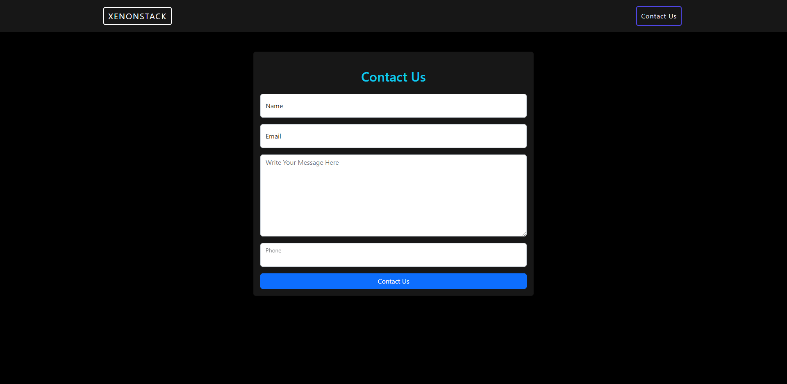
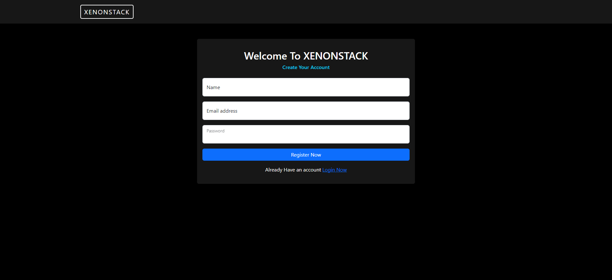
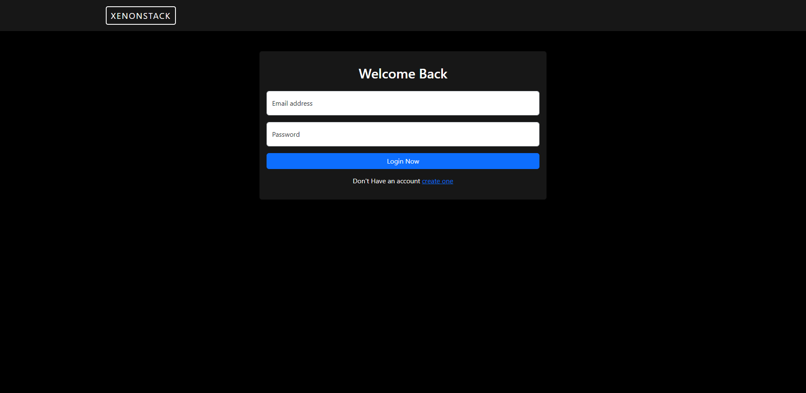

# XENONSTACK ASSiGNMENT

*This is my solution of XENONSTACK assignment.*

### PROJECT DESCRIPTION
*This is a contact page of any website, authenticated user can see the homepage and send us a contact message. In this application user can signup or login, once they authenticate themself they can view our homepage and send us a contact message and their message will be stored in our database.*

*logged in user home page*

*contact page for logged in user*

*signup page*

*login page*

### INSTALLATION GUIDE
- go to backend directory and install all the dependencies using command `npm install`
- start the backend development server with `npm run dev`
- now go to fronend directory and install all the dependencies using command   `npm install`
- stra the frontend app with `npm start` command.
  

### TECH STACK
- NodeJs
- Expressjs
- ReactJs
- MongoDB
  
 
